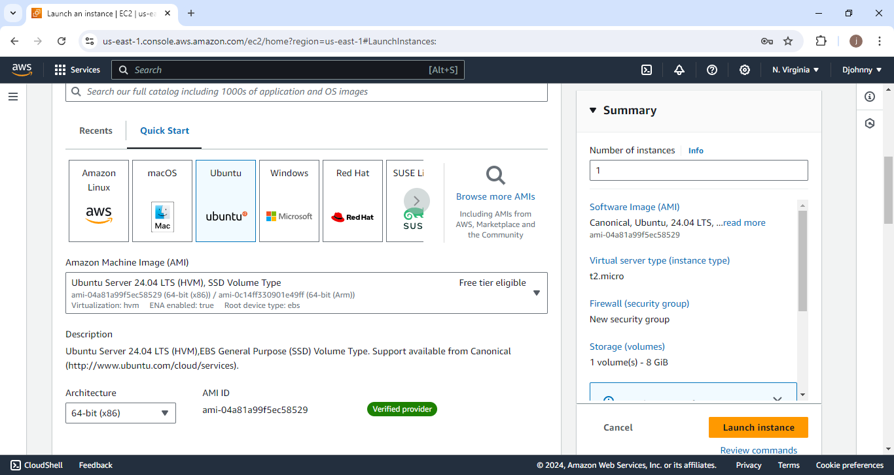
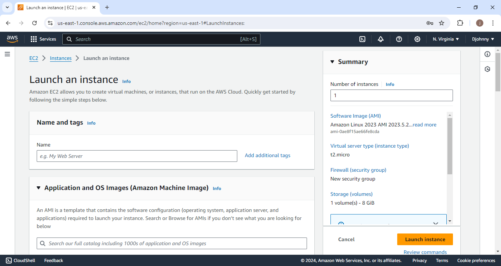
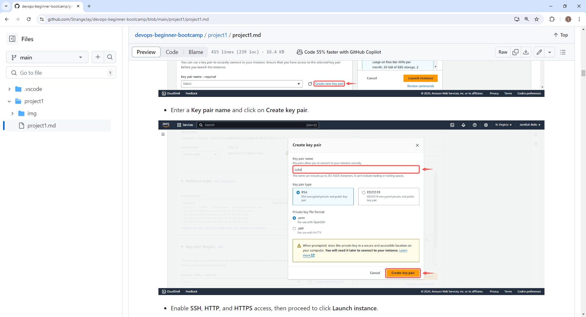
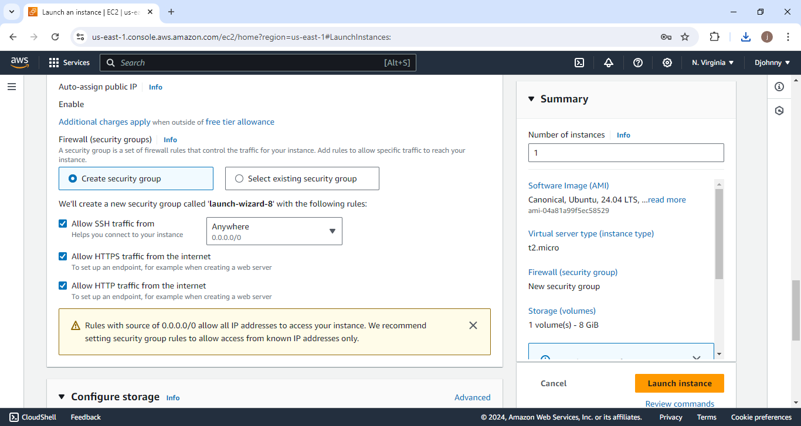

**Documentation**

Create an Ubuntu Server

Click on **Launch instance**

- Name your instance and select Ubuntu AMI

- Click the **Create new key pair** button to generate a key pair for secure connection to your instance

Enable **SSH**, **HTTP**, and **HTTPS** access then rproceed to click **Launch instance**

