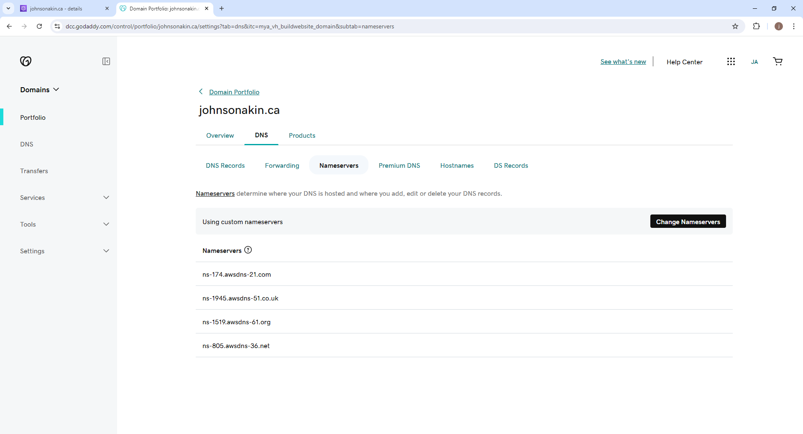

**Documentation**

 - Spin up Ubuntu server, create an elastic IP and associate it to your instance

- Please refer to Project 1 Documentation

- Install Nginx and set up your 
website

- Execute the following commands

- sudo apt update - sudo apt upgrade - sudo apt install nginx

- Start your Nginx server by running the sudo systemctl start nginx command, enable it to start on boot by executing sudo systemctl enable nginx, and then confirm if it's running with the sudo systemctl status nginx command.

- Visit your instances IP address in a web browser to view the default Nginx startup page.

- Download your website template from your preferred website by navigating to the website, locating the template you want.

- Right click and select Inspect from the drop down menu.

- Click on the Network tab and then click Download button

- To install the unzip tool, run the following command: sudo apt install unzip

- Execute the command to download and unzip your website files sudo curl -o /var/www/html/2134_gotto_job.zip https://www.tooplate.com/zip-templates/2134_gotto_job.zip && sudo unzip -d /var/www/html/ /var/www/html/2134_gotto_job.zip && sudo rm -f /var/www/html/2133_moso_interior.zip

- Copy and paste the following code into the open text editor server {
    listen 80;
    server_name example.com www.example.com;

    root /var/www/html/example.com;
    index index.html;

    location / {
        try_files $uri $uri/ =404;
    }
}

- Configure your second website by creating a new file in the Nginx sites-available directory with the following command: sudo nano /etc/nginx/sites-available/moso_interior

- Edit the root directive within your server block to point to the directory where your downloaded website content is stored

- Create a symbolic link for both websites by running the following command. sudo ln -s /etc/nginx/sites-available/cleaning /etc/nginx/sites-enabled/ sudo ln -s /etc/nginx/sites-available/health /etc/nginx/sites-enabled/

- Run the sudo nginx -t command to check the syntax of the Nginx configuration file.

- Delete the default files in the sites-available and sites-enabled directories by executing the following commands:

sudo rm /etc/nginx/sites-available/default
sudo rm /etc/nginx/sites-enabled/default

Restart the Nginx server by executing the following command: sudo systemctl restart nginx.

**Create an A Record**

- Refer to Project 1 on instructions on how to create a hosted zone

- In route 53, select the domain name and click on Create record.

- Paste your IP address① and then click on Create records②

- Click on Create record again, to create the record for your sub domain.

- Input the Record name①, paste your IP address② and then click on Create records③

- Repeat the same process while creating your second subdomain record, and confirm that they both exist in the records list.

- Open your terminal and run sudo nano /etc/nginx/sites-available/cleaning to edit your settings. Enter the name of your domain and then save your settings.

- Run sudo nano /etc/nginx/sites-available/health to edit your settings. Enter the name of your domain and then save your settings.

- Restart your nginx server by running the sudo systemctl restart nginx command.

- Go to your domain name in a web browser to verify that your website is accessible.

**Install certbot and Request for an SSL/TLS Certificate

- Install certbot by executing the following commands: sudo apt update sudo apt install python3-certbot-nginx sudo certbot --nginx

- Execute the sudo certbot --nginx command to request your certificate. Follow the instructions provided by certbot and select the domain name for which you would like to activate HTTPS.

- Verify the website's SSL using the OpenSSL utility

- Visit https://<domain name> to view your websites.
